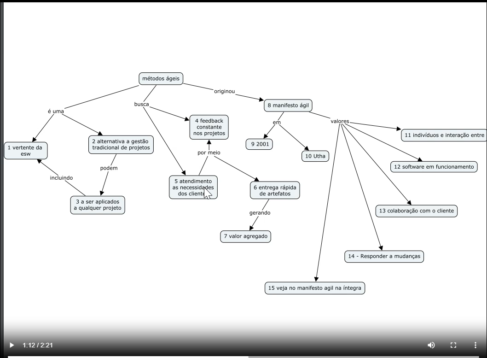
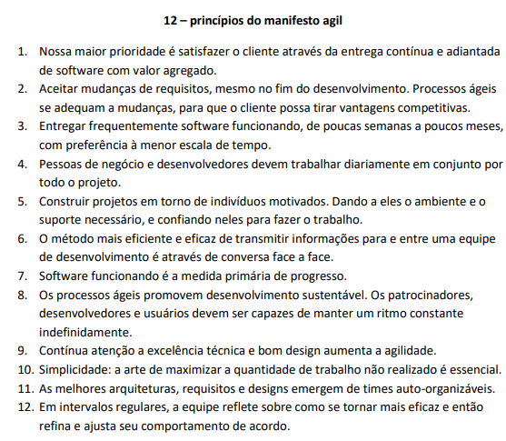
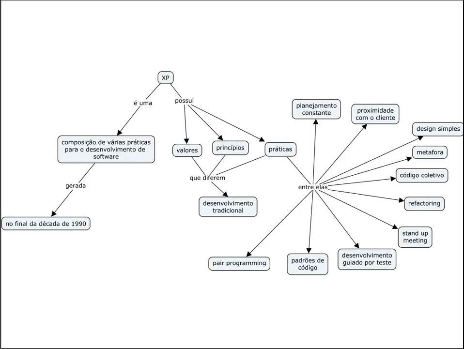
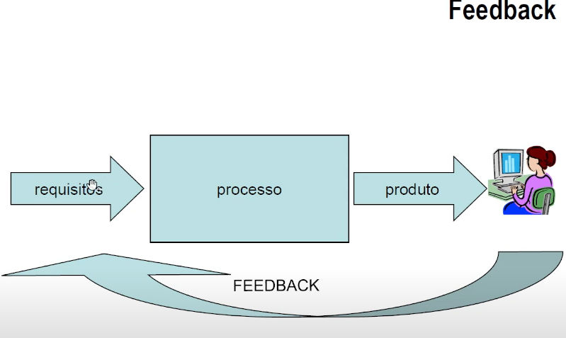
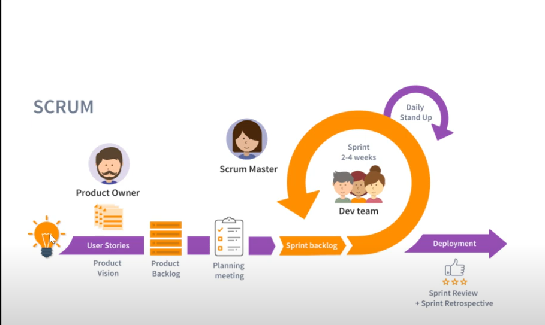

# Métodos ágeis
## Livros recomendados

* CAMARGO, Robson Alves de; RIBAS, Thomaz. Gestão ágil de projetos. São Paulo: Saraiva, 2019. E-book. ISBN 9788553131891.

* COUTINHO, Heitor. Estratégia ágil além da prática. São Paulo: Saraiva, 2021. E-book. ISBN 9786587958224.

* RUBIN, Kenneth S. Scrum essencial: um guia prático para o mais popular processo ágil. Rio de Janeiro: Alta Books, 2017. E-book. ISBN 9788550804118.

# Aula 01

## Definindo métodos ágeis

* 

## Doze princípios do manifesto ágil

* 

* site [https://agilemanifesto.org/]

## Participantes do manifesto ágil

* 

## Visão Geral Extrem programming

* 

## Processos ágeis - definicões 

### Metáforas

* Você na escola e a professora solicita uma redação.

* que procedimento você adotaria para escrever um bom texto?

* começar explorando o assunto, mentalmente, tentando organizar os tópicos.

* Em seguida, começaria a escrever as primeiras linhas

* após alguns parágrafos, você faria algumas alterações em trechos já escritos, visando o aprimoramento

* ao final, você faria uma re-leitura, corrigiria algumas partes, retocaria alguns trechos, até que o texto tivesse adequado

* escrever uma redação éuma atividade, puramente, intelectual.

* a pintura se encaixa na mesma premissa, quando um pinto cria  um novo quadro é comum começar com alguns esboços, produzir sucessivas e evoluções até chegar ao produto final.

* ambas as atividades, escrita e pintura, não são desenvolvidas de forma linear

* ausência de linearidade nos leva ao não determinismo. não é possível prever os caminhos que nos leva ao produto final

* porém existem regras para toda criação?
    - redação: regras gramaticais, números de linhas

* resumindo, uma obra intelectual possui:
    - necessidade de revisões;
    - ausência de linearidade;
    - ausência de determinismo.

* até certo ponto, o ato de desenvolver software é uma atividade intelectual e incorpora as características supra citadas.

* assim como o ato de pintar e escrever, durante o desenvolvimento do software, o cliente aprende com a manipulação do produto - feedback

* a principal premissa de um processo ágil é o feeedback.
    * por meio desta técnica o cliente e a qeuipe aprendem, o que o software deve manipular no contexto sistêmico
    * característica evolucionária do processo. 

## valores do extreme program

* Feedback
* comunicação
* simplicidade
* coragem

### Feedback

* 

* no xp o cliente atual como produtor e consumidor, permatente de requisitos.

1. o cliente produz uma ideia nova, rapidamente, apresenta a equipe.

2. a equipe consome a ideia, produzindo as alterações no software.

3. e as apresenta para o cliente.

4. retorna ao passo 1.

5. condição de parada: cliente satisfeito.

* o feedback garante uma forte comunicação entre cliente e equipe, este fato pode diminuir os erros de interpretação, visto que o cliente está proximo do ciclo de produção

* forma de comunicação adotada pelo xp, mantenha a proximidade com o cliente.

* interação - cliente e a equipe

### Comunicação

* feeadback, intimamente, ligado a comunicação intensiva.

* formas de comunicação:
    * face-a-face
    * telefone
    * e-mail
    * msn, skype
    * etc

* a forma de comunicação influencia a capacidade de compreensão

* no xp, o objetivo da documentação é registrar o trabalho que já foi executado, ao invés de descrever o que deve ser feito.

* a explicação do que precisa ser feito é feita de forma iterativa. Utilização cartão de estórias

### Simplicidade

* para se obter um bom feedback é necessário que as ações dos membros da equipe sejam simples.

* com a simplicidade o feedback ocorre rapidamente, pois o cliente entende o que está acontecendo.

* ao solicitar uma funcionalidade:
    * implemente somente o que foi pedido;
    * o suficiente para atender o cliente;
    * funcionalidade simples, os desenvolvedores economizam em especulações;
    * especulações devem ocorrer junto ao cliente, em funcionalidades que ele não tem certeza;
    * não assuma que o cliente terá novas necessidades no futuro, pergunte a ele sobre isto.

* o prinipal objetivo da simplicidade é evitar o retrabalho, que muitas vezes resulta da precipitação da equipe de desenvolvimento.
    * se implementamos uma funcionalidade com mais detalhes, sem termos certeza, estamos investindo tempo e dinheiro em algo incerto.

### Coragem
* o xp é um processo de software que contraria os processos tradicionais de desenvolvimento de software. sendo assim a adoção do xp exige que a equipe de desenvolvimento tenha coragem para:
1. desenvolver software de forma evolucionária
2. manter o software simples;
3. permitir que o cliente priorize as funcionalidades
4. fazer os desenvolvedores trabalhar em par
5. investir tempo em refactoring
6. investir tempo em testes automatizados
7. estimar as estórias na presença do cliente
8. expor o código a todos os membros da equipe
9. integrar o software várias vezes ao dia
10. adotar ritmo sustentável
11. abrir mão de documentações que servem como defesa
12. propor contrados de escopo variável
13. propor a adoção de um novo processo por parte da equipe

## Atividade 1

1. Relacione os 12 princípio ágeis com os valores delineados com XP. Quais dos princípios são aglutinados no XP? Procure buscar evidências textuais para justificar as relações.

2. Abaixo você encontra dois microlearning, Existe alguma relação entre os microlearnings? Se sim qual? 

    a) a agilidade está na atitude: 
    [https://engenhariasoftware.wordpress.com/2020/08/27/a-agilidade-encontra-se-na-atitude/]


    b) Capacidade, Agilidade e Perseverança…
    [https://engenhariasoftware.wordpress.com/2015/04/29/capacidade-agilidade-e-perseveranca/]

# Aula 02

## Programação em par    
* Deve ser trabalhada em sistemas complexos. 
* programação em par ou pair-programming.
* o desenvolvedor nunca trabalha sozinho
* técnica na qual dois programadores trabalham em um mesmo problema, ao mesmo tempo e em um mesmo computador
* Enquanto uma pessoa (o condutor) assume o teclado e digita os comandos que farão parte do programa, a outra ( o navegador) acompanha fazendo o trabalho de estrategista.
* Revisão de código (navegador). Pequenos erros são corrigidos no ato.
* modelagem do programa pode ficar mais otimizada, pois existem dois programadores trabalhando em conjunto.
* a modelagem do programa é, geralmente, mais simples.
* questões apresentadas sobre a programação em par
    * por que colocar duas pessoas para fazer o trabalha de uma?
    * não estamos desperdiçando uma pessoa?
    * e como desperdiçar uma pessoa com os prazos apertados, fato este frequente em um projeto de software?
* porém a programação em par traz vários benefícios relacionados a produtividade, veja só o exemplo:
    *  Um desenvolvedor trabalhando dozinho, gasta um dia para implementar uma funcionalidade.
    * se a funcionalidade for implementada em par, o tempo gasto é menor.
    * resultados comprovados no artigo de `laurie williams`
    * a curto prazo os benefícios são pequenos, porém a longo prazo eles são enormes (pouquíssimo errosno código). futuramente, menos tempo para descobrir as causas do defeito.
* alguns problemas podem afetar a atividade de programação:
    * cansaço
    * desânimo
    * desmotivação
    * frequentes interrupções:
        * e-mail,
        * mensagens instantâneas
        * telefonemas
* a programação em par corrige tais problemas, quando programador está acompanhado de outra pessoa, ele deixa de ter um compromisso somente consigo mesmo.
    * Focos de distração são eliminados.
*  Exemplo 1
    * você está programando com alguém ao seu lado.
    * de repente, você decide consultar seus e-mails
    * como você vai fazer isto tendo alguém ao seu lado
    * certamente, você pode fazer, mas é estranho, não?
    * você não se entirá a vontade. correto
    * pois você tem uma responsabilidade compartilhada.
* Exemplo 2
    * você programando e depara com aquele problema
    * você não está disposto a solucionar, naquele momento.
    * seu par irá te ajudar, incentivando, assumindo o teclado, substituindo você na condução da programação.
* Troca de lugar. O condutor assume o lugar do navegador e o navegador assume o lugar do condutor.

* Troca de pares

* Lembre-se. É necessário estipular regras para estas trocas. 

* Disseminação de conhecimento
    * A programação em par provê a homogeneidade do conhecimento na equipe de desenvolvimento
    * Imagine que você é programador mais experiente e está fazendo par  com um novato
    * suponha que o novato seja o condutor
    * diversas vezes pode identificar pontos de melhoria no trabalho do colega, pois você é mais experiente.
    * você está contribuindo com o aumento do conhecimento do colega.
    * a programação em par equaliza o conhecimento dentro da equipe
    * quem sabe mais, ensina quem sabe menos.
    * a equipe é nivelada por alto
    * a programação em par permite que novos ( recém chegados) membros na equipe tomem conhecimento sobre o projeto do software.
    * nos processos tradicionais, para ter conhecimento sobre projeto, os novos membros devem ler a documentação do projeto
    * já na programação em par a transferencia de conhecimento se dá dentro de cum contexto bem definido
    * exemplo:
        * suponha que ao implementar uma funcionalidade, você tenha que alterar algumas partes do código que já estão prontas.
        * você não conhece tais partes.
        * seu par irá transferir este conhecimento para você.
    * o apredizado por meio de documentação é menos eficaz
    * pois você não estará aprendendo algo para resolver um problema bem definido.
    * você não tem uma necessidade bem definida para aplicar a informação que está lendo.
    * o documento é frio e se limita àquilo que seu autor decidiu escrever. já o parceiro é vivo e irá explicar tudo aquilo que for necessário para você compreender o assunto.
*  desafio da programação em par
    * organização do escritório, mesa deve lugar para dois desenvolvedores
    * A visão gerencial:
        * desafio a vencer: porque ter progração em pares, se eu posso produzir o código, somente com uma pessoa?
    * O relacionamento humano
        * conciliar vicões diferentes entre desenvolvedores.
        * insegurança e medo que outra pessoa veja seu código.
        * medo que as pessoas descubram que você não é tão bom assim.
    * Alguns programadores acham que são muito superiores aos seus colegas
    * este tipo de pessoa costuma ter problemas com a idéia da programação em par.
    * este tipo de pessoa acredita que é perda de tempo dividir o trabalho com outra pessoa.
    * a arrogância é, extremamente, prejudicial à prática da programação em par. 
    * todos os membros da equipe necessitam exercitar a humildade.
    * é necessário ser paciente em certa ocasiões, pois, as vezes você percebe que poderia solucionar o problema de uma melhor forma se estivesse sozinho.
    * lembre-se que seu colega está no meio de um aprendizado.
    * competição:
        * algo que definitivamente não pode existir em um projeto XP
        * em um ambiente competitivo as pessoas não se ajudam
        * algumas empresas fomentam este tipo de ambiente, quando estabelecem sistemas de incentivos baseados em desempenho individual

* concluindo
    * os efeitos sobre a produtividade;
    * a pressão do par
    * o revezamento
    * a disseminação do conhecimento
    * os desafios da programação em par.
* Artigos:
    * <a href="QuandoAProgramacaoEmParesDeveSerAdotadaEmUmAmbienteEmpresarial.pdf" target="_blank">Quando a Programacao em Pares Deve Ser Adotada em Um Ambiente Empresarial</a>
    * <a href="StrengtheningTheCaseForPairProgramming.pdf" target="_blank">Strengthening The Case For Pair Programming</a>

## Padrão de código

* programadores com estilos diferenciados em relação a programação.
* Exemplo:
```javascript
    public int soma (int a,int b){
        return a+b;
    }

    public int soma(int a, int b)
    {
        return a+b;
    }
```
* as diferenças no estilo, dificultam a compreensão do código pelos membros da equipe
* fato que pode ser evitado de todos adotarem o mesmo padrão para codificação.
* o xp recomenda que se adote um padrão no início do projeto.
* possibilidade de construção de um padrão ou utilizar um já existente.
* java code convention.
* procure adotar um padrão que seja fácil e simples. isto evita resitência facilita a compreensão.
* topicos que devemos considerar em um padrão para codificação:
    * identação:
        * mesma largura na tabulação
        * mesmo posicionamento das chaves
        * sempre faça identação de um código que esteja subordinado ao outro.
        * 
    * letras maiúscula e menúscula?
        * Consitência
    * comentários
        * procure evitá-los
        * seja claro, simples e transmita sua intenção
        * escreve um comentário somente quando você precisar dele
        * exemplo: explicar uma otimização ou algo que você simplesmente não consegue facilitar
        * lembre-se que um código evolui e o comentário deve evoluir com ele
    * Nomes:
        * utilize nomes que comunique e não seja convenientes para digitar
        * normalmente,nomes longos são melhores (dentro do racional)
    * mantendo o padrão:
        * códgo coletivo ajuda a equipe a manter o padrão.
        * o padrão facilita a implantação da prática de código coletivo
* ao identificar um código fora do padrão:
    * alertar a equipe que estava fora do padrão e qual seria a forma correta de utilizar o padrão on caso em questão.
    * fazer o refactoring no código de modo que ele fique no padrão
    * publicar as regras do padrão que geram mais dúvidas nos quadros brandos da sala.
    * as vezes é necessário ajustar o padrão para que ele se aproxime daquilo que a maioria dos programadores já está habituada a fazer.
* dificulade na adoção de um padrão em pares
    * resistência por parte dos programadores.

* <a href="JavaCodeConventions.pdf" target="_blank">Java Code Conventions</a>

# Aula 03

* Desenvolvimento guiado por teste e stand up meeting. 
* <a href="https://engenhariasoftware.wordpress.com/2009/05/18/desenvolvendo-a-atividade-de-teste-de-software-%E2%80%93-parte-1/">Testes de software - parte 1</a>
    * Processo de construção de software: Levantamento de requisitos, modelagem de negócio (análise de sistemas), projeto de software, programação, teste, implantação e manutenção.
    * A atividade de teste é dividida em teste de caixa preta e teste de caixa branca.
    * Teste exaustivo: Testar todos os possíveis dados de entrada.
    * Particionamento em classe de equivalência:
    , análise do valor limite e o teste funcional.


# Aula 3

## Testes de software

<a href = "https://engenhariasoftware.wordpress.com/2009/05/18/desenvolvendo-a-atividade-de-teste-de-software-%E2%80%93-parte-1/">Desenvolvendo a atividade de teste de software</a>

<a href="https://engenhariasoftware.wordpress.com/2008/09/23/um-pouco-de-teste-de-software/">Um pouco de teste de software</a>

<a href = "https://engenhariasoftware.wordpress.com/2008/09/25/mais-um-pouco-de-teste-de-software/">Mais um pouco de teste</a>

## Standup meeting
* um dia de trabalho de equipe xp começa com o standup meeting (reunião em pé)
* todos estão em pé, mesmo!!


* Formato da reunião
    * ocorrencia: todos os dias
    * duração: de 10 a 20 minutos
    * participantes: todos os membros da equipe
    * horário: antes de iniciar as atividades do dia de trabalho

* porque todos em pé?
* isto incentiva que a reunião seja rápida
* objetivos da reunião
    * todos membros da equipe comentam o trabalho do dia anterior
    * atualização da equipe perante ao projeto
    * apresentar os desafios que enfrentaram, e quais as soluções criadas.
    * avaliar o trabalho do dia anterior, identificando pontos fracos no processo.
    * decide o que será feito no dia que se inicia.
    * priorizar as atividades da equipe ao longo do dia
        * quais cartões serão tratados naquele dia.
* todos devem falar pelo menos por alguns minutos.

# Aula 4
* <a href="https://engenhariasoftware.wordpress.com/2018/08/20/cliente-sempre-presente-em-projeto-de-software/">cliente sempre presente em um projeto de software</a>
## Refactoring
* O que fazer com um código que está funcionando, mas um pouco legível?
* como proceder diante de um código mal escrito, mas que funciona?
* O ditado popular já disse: em time que está ganhando não se mexe
* Não mexer em código que já está funcionando é uma regra implícita na maioria dos processos de software
* Não mexer em um código mal escrito pode acarretar problemas, por exemplo:
    * qualquer parte do software pode precisar ser visitada no puturo para se fazer manutenções corretivas, preventivas ou adaptativas.
    * java code convention
* um código mal formulado cria sérias dificuldades para quem um dia tiver necessidade de modificá-lo ou compreendê-lo
* quando o código está legível é possível alterá-lo rapidamente.
* o xp recomenda que os desenvolvedores não fiquem parados diante desta situação
* se o desenvolvedor tem alguma dúvida em uma parte do código, ele deve procurar compreendê-lo e, em seguida, reescrevê-lo de modo a ficar mais legível
* ele não está alterando a funcionalidade, dado que o código continua fazendo a mesma coisa
* ele só está tornando mais legível.
* toda atividade citada, recebe o nome de refactoring.
* na verdade o xp vai além:
    * é obrigação do programador fazer o refactoring de qualquer parte do código que esteja pouco legível
* a alteração não deve afetar o comportamento que originou do código, ela deve apenas torná-lo mais legível.
* o conceito de refactoring ainda de mãos dadas com a prática de código coletivo.
* o refactoring torna simples a prática de código coletivo, pois os desenvolvedores conseguem ler qualquer parte do código facilmente.
* a prática do código coletivo ajuda a equipe a identificar a prática do refactoring.
* quando várias pessoas lêem o mesmo co´digo, fica mais fácil identificar práticas mal formuladas.
* Metáfora:
    * o software é como nossa casa
    * a casa é um lugar que vive em constante evolução e mutação
    * existe uma certa estabilidade, mas de vez em quando acontece uma coisa nova
    * compramos um aparelho, colocamos um quadro na parede, ou encontramos um belo tapete para o chão.
    * temos duas abordagens para nossa casa:
        * organizada ou desorganizada
    * as pessoas lavam os pratos, retiram o lixo, arrumam a cama e executam outras atividades.
    * estas atividades tem um pequeno custo diário. entretanto ela gera flexibilidade, agilidade e conforto
    * suponha que vc queira convidar alguns amigos para jantar em sua casa, se vc for desorganizado, será preciso marcar o jantar com dois meses de anteced~encia.
    * pois você necessita organizar a bagunça.
    *  porém se a casa for organizada, você pode convidá-los para jantar no dia seguinte.
    * a casa fornece agilidade, flexibilidade e conforto.
    * o mesmo acontece com o software
    * com algumas ações diárias a equipe pode mantê-lo organizado e legível
    * isto permite ao cliente que incorpore qualquer necessidade com agilidade.
* xp e refactoring: uma relação importante, pois o refactoring fornece agilidade para a questão do feedback
* na comunidade xp persiste um ditado:
    * um dia sem refactoring é como um dia sem sol

## Codigo coletivo

* projeto implementado por uma equipe:
    * dividi-lo em partes
    * cad membro da equipe fique responsável por uma parte
    * cada pessoa é responsável por um conjunto de código
* é comum encontrar as ilhas de conhecimento
    * pessoa que conhece muito uma parte do código
    * se alguém necessitar mexer no código deve pedir auxilio a ilha de conhecimento
* problemas
    * a ilha pode se transformar em um gargalo dentro do projeto caso a parte do código que está sob sua responsabilidade precise ser modificada inúmeras vezes.
    * a pessoa não consegue atender a demanda.
    * se a pessoa ficar doente, e não for trabalhar alguns dias?
    * se alguém necessitar mexer no código, sem a ajuda desta pessoa não conseguirá ou terá grande dificuldade.
* Naturalmente um pouco de documentação pode ajudar, desde que ela venha sendo atualizada pelo nosso personagem adoentado.
* com o conceito de ilha de conhecimento e possível saber se o código está legível
* estes fator levaram o xp a propor a utilização de código coletivo
* código estará sendo sempre revisado.
* a programação em par já colabora para evitar a formação de ilhas de conhecimento
* importante: todos sabem que o código sofrerá visitas durante a execução do projeto, isto leva os desenvolvedores a deixá-lo o código sempre legível.
* código coletivo demanda coragem por parte dos desenvolvedores. afinal, diversas vezes ao dia o desenvolvedor terá que mexer em partes do sistema que não foram construídas por ele.
* O código coletivo depende de duas outras práticas
    * refactoring
    * programação em pares


stand up meeting quando aplicar: [https://engenhariasoftware.wordpress.com/2018/08/21/stand-up-meeting-quando-aplicar/]

# Aula 5

##  Uma visão geral do SCRUM

* 

PO: Conjunto de ideias, histórias, relacionadas ao produto.
PB: itens que devem ser desenvolvidos.
PM(planning meeting): reunião de planejamento com os times e realizar a priorização
Sprint Backlog: tempo que será desenvolvido
Daily Stand Up: fazer reuniões diárias para alinhar o projeto, reunião rápida. Vitórias, dificuldades e dores. 
Deployment(sprint review + sprint retrospective): Entrega do produto.

### outros recursos

Agile e planejamento Estratégico: [https://engenhariasoftware.wordpress.com/2016/10/04/agile-strategic-planning-tecnica-para-o-desenvolvimento-e-execucao-de-um-planejamento-estrategico-modelo-de-referencia/]

# Aula 6

* canvas e scrum
* usado para completar a frase "e se..."
* Criar backlog canvas
* pegar as atividades chaves
* detalhar melhor as atividades chaves no product backlog
* 

